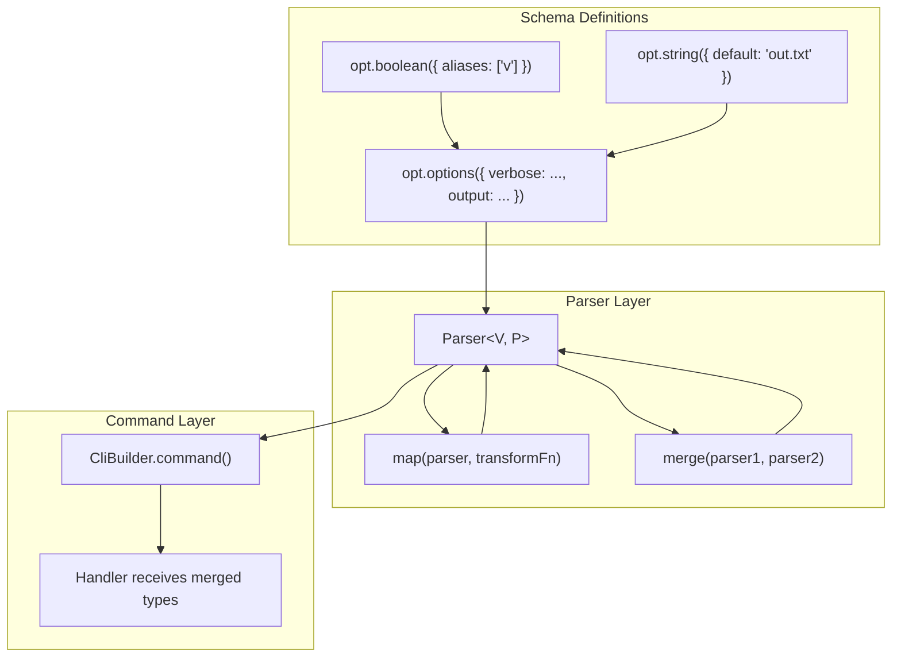
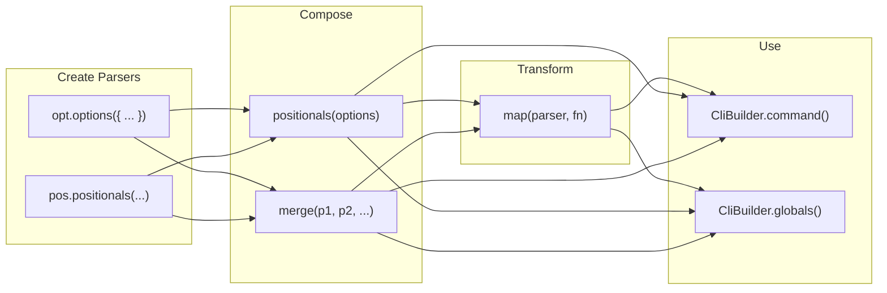
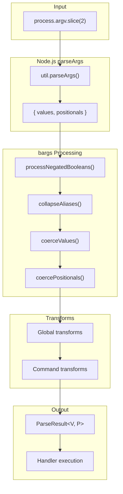

# Architecture

This document describes the design philosophy, core concepts, and internal architecture of **bargs**.

## Overview and Philosophy

**bargs** is a thin, type-safe wrapper around Node.js's built-in [`util.parseArgs()`](https://nodejs.org/api/util.html#utilparseargsconfig). Rather than reinventing argument parsing, bargs delegates the low-level tokenization to Node's battle-tested implementation and focuses on what it does best: **type inference** and **composable schema definitions**.

### Design Goals

1. **Full TypeScript inference** - Option definitions flow through to handlers with zero type annotations required
2. **Pipe-style composition** - Parsers combine naturally using function call syntax, enabling left-to-right data flow
3. **Minimal API surface** - A small set of composable primitives rather than a sprawling DSL
4. **Zero runtime dependencies** - Only Node.js built-ins

### Contrast with Other Approaches

| Approach               | Example   | Trade-off                                                               |
| ---------------------- | --------- | ----------------------------------------------------------------------- |
| **Builder chains**     | yargs     | Powerful but complex; types often require manual annotation             |
| **Decorator-based**    | oclif     | Requires classes and experimental decorators                            |
| **Schema DSLs**        | commander | Simple but limited type inference                                       |
| **Parser combinators** | bargs     | Composable with full inference; requires understanding the mental model |

bargs chooses parser combinators because they naturally express the "build up a schema, then parse" pattern while preserving types at each step.

## Core Concepts

### Terminology

| Term           | Description                                                                      |
| -------------- | -------------------------------------------------------------------------------- |
| **Option**     | A named flag like `--verbose` or `--output file.txt`                             |
| **Positional** | An unnamed argument like `file.txt` in `cat file.txt`                            |
| **Parser**     | A data structure holding option and positional schemas with their inferred types |
| **Command**    | A Parser with an attached handler function                                       |
| **Handler**    | A function that receives parsed values and positionals                           |
| **Transform**  | A function that modifies parsed results before they reach handlers               |

### Parser

The `Parser<TValues, TPositionals>` is the central data structure. It represents accumulated parse state and carries two kinds of information:

```typescript
interface Parser<TValues, TPositionals extends readonly unknown[]> {
  // Runtime schemas (used for actual parsing)
  readonly __optionsSchema: OptionsSchema;
  readonly __positionalsSchema: PositionalsSchema;

  // Compile-time phantom types (used for type inference)
  readonly __values: TValues;
  readonly __positionals: TPositionals;

  // Brand for runtime type discrimination
  readonly __brand: 'Parser';
}
```

**Why branded types instead of classes?**

bargs uses a `__brand` field for runtime type discrimination rather than `instanceof` checks. This choice enables better TypeScript structural typing—the compiler can infer and merge types without fighting class hierarchies or prototype chains. In other words: _have you ever tried to use mixins in TypeScript?_

### Command

A `Command<TValues, TPositionals>` is a Parser that has been paired with a handler function. It's the "terminal" in a pipeline—once you attach a handler, the parser is ready to execute.

```typescript
interface Command<TValues, TPositionals extends readonly unknown[]> {
  readonly __brand: 'Command';
  readonly __optionsSchema: OptionsSchema;
  readonly __positionalsSchema: PositionalsSchema;
  readonly handler: HandlerFn<TValues, TPositionals>;
}
```

### CliBuilder

The `CliBuilder` provides a fluent API for registering commands and configuring a CLI:

```typescript
bargs('my-cli', { version: '1.0.0' })
  .globals(globalParser) // Set global options
  .command('add', parser, handler) // Register a command
  .defaultCommand('list') // Set default command
  .parseAsync(); // Execute
```

The builder maintains internal state including registered commands, aliases, global parser, and theme configuration.

## Type Inference Flow

Types flow from individual option definitions through parsers to command handlers:



### Inference at Each Step

1. **Option builders** (`opt.boolean()`, `opt.string()`, etc.) return typed definitions that preserve all properties:

   ```typescript
   const verbose = opt.boolean({ aliases: ['v'] });
   // Type: BooleanOption & { aliases: ['v'] }
   ```

2. **`opt.options()`** transforms a schema object into a `Parser` with inferred values:

   ```typescript
   const parser = opt.options({
     verbose: opt.boolean(),
     count: opt.number({ default: 0 }),
   });
   // Type: Parser<{ verbose: boolean | undefined, count: number }, []>
   ```

3. **Transforms** via `map()` can change the shape of parsed results:

   ```typescript
   const transformed = map(parser, ({ values, positionals }) => ({
     values: { ...values, timestamp: Date.now() },
     positionals,
   }));
   // Type: Parser<{ verbose: boolean | undefined, count: number, timestamp: number }, []>
   ```

4. **Handlers** receive the fully-merged type (globals + command-local):

   ```typescript
   .command('build', buildParser, ({ values }) => {
     // values: GlobalOptions & BuildCommandOptions
   })
   ```

## Pipe-Style Composition

### The CallableParser Pattern

Both `opt.options()` and `pos.positionals()` return **callable parsers**—objects that are simultaneously:

1. A `Parser` (with all schema properties)
2. A function that merges with another parser

This enables pipe-style composition:

```typescript
// Left-to-right: positionals first, then merge options into them
const parser = pos.positionals(pos.string({ name: 'input', required: true }))(
  opt.options({ verbose: opt.boolean() }),
);
// Type: Parser<{ verbose: boolean | undefined }, [string]>
```

The call syntax `positionals(options)` reads as "take positionals, merge in options." This is the **primary** composition style in bargs.

### Alternative: Explicit merge()

For those who prefer explicit function calls:

```typescript
const parser = merge(
  pos.positionals(pos.string({ name: 'input', required: true })),
  opt.options({ verbose: opt.boolean() }),
);
```

Both approaches produce identical results. Use whichever reads more clearly for your use case.

### Composition Diagram



## Division of Responsibilities

### What Node's parseArgs() Handles

Node's `util.parseArgs()` is responsible for:

- **Tokenizing** the argument array
- **Matching** flags to option names (`--verbose`, `-v`)
- **Boolean detection** (flags without values)
- **Short option handling** (`-v` from `short: 'v'`)
- **Strict mode validation** (unknown options throw)

### What bargs Adds

bargs wraps parseArgs() and adds:

| Feature                | Description                                                             |
| ---------------------- | ----------------------------------------------------------------------- |
| **Type coercion**      | Converts strings to numbers, validates enum choices                     |
| **Default values**     | Applies defaults when options are omitted                               |
| **Boolean negation**   | `--no-verbose` sets `verbose` to `false`                                |
| **Multi-char aliases** | `--verb` as alias for `--verbose` (parseArgs only supports single-char) |
| **Positional parsing** | Typed positionals with required/optional, variadic support              |
| **Validation**         | Required options, enum choices, alias conflicts                         |
| **Help generation**    | Themed, formatted help text with grouping                               |
| **Commands**           | Subcommand dispatch with merged globals                                 |

### Parsing Pipeline



## Module Responsibilities

| Module                           | Responsibility                                                                                                                                                                                             |
| -------------------------------- | ---------------------------------------------------------------------------------------------------------------------------------------------------------------------------------------------------------- |
| [`types.ts`](src/types.ts)       | All type definitions: option/positional interfaces, `Parser`, `Command`, `CliBuilder`, and inference utilities (`InferOptions`, `InferPositionals`)                                                        |
| [`opt.ts`](src/opt.ts)           | Builder functions for options (`opt.string()`, `opt.boolean()`, etc.) and positionals (`pos.string()`, `pos.variadic()`, etc.), plus the `opt.options()` and `pos.positionals()` callable parser factories |
| [`parser.ts`](src/parser.ts)     | Low-level wrapper around `util.parseArgs()`. Handles config building, type coercion, boolean negation, and alias collapsing                                                                                |
| [`bargs.ts`](src/bargs.ts)       | The `bargs()` entry point, `CliBuilder` implementation, and combinator functions (`map`, `merge`, `handle`, `camelCaseValues`)                                                                             |
| [`help.ts`](src/help.ts)         | Help text generation with theming, grouping, and formatting                                                                                                                                                |
| [`theme.ts`](src/theme.ts)       | ANSI styling, built-in themes, and custom theme support                                                                                                                                                    |
| [`osc.ts`](src/osc.ts)           | Terminal hyperlink support (OSC 8 sequences)                                                                                                                                                               |
| [`errors.ts`](src/errors.ts)     | Error classes: `BargsError`, `HelpError`, `ValidationError`                                                                                                                                                |
| [`validate.ts`](src/validate.ts) | Schema validation utilities                                                                                                                                                                                |

## Nested Commands

bargs supports arbitrarily nested command hierarchies (e.g., `git remote add`). The **factory pattern** provides full type inference for parent globals in nested handlers.

### Factory Pattern

```typescript
bargs('git')
  .globals(opt.options({ verbose: opt.boolean() }))
  .command(
    'remote',
    (remote) =>
      remote
        .command('add', addParser, ({ values }) => {
          // values.verbose is typed! (from parent globals)
        })
        .command('remove', removeParser, removeHandler)
        .defaultCommand('list'),
    'Manage remotes',
  )
  .parseAsync();
```

The factory function receives a `CliBuilder` that already carries the parent's global types. This allows nested handlers to see merged `parent globals + command options` types at compile time.

### Runtime Flow

At runtime, parent globals flow through the `parentGlobals` state:

1. Parent CLI parses global options from args before the command name
2. When delegating to a nested builder, `parentGlobals` is passed along
3. Nested handlers receive merged `{ ...parentGlobals.values, ...commandValues }`

### Subcommand Aliases

Both parent command groups and individual subcommands support aliases:

```typescript
.command(
  'remote',
  (remote) => remote
    .command('remove', parser, handler, { aliases: ['rm', 'del'] }),
  { aliases: ['r'], description: 'Manage remotes' },
)
// All equivalent: git remote remove, git r remove, git remote rm, git r rm
```

## Key TypeScript Patterns

### Branded Types

```typescript
interface Parser<V, P> {
  readonly __brand: 'Parser'; // Runtime discrimination
  // ...
}

const isParser = (x: unknown): x is Parser<unknown, readonly unknown[]> =>
  x !== null &&
  typeof x === 'object' &&
  '__brand' in x &&
  x.__brand === 'Parser';
```

Using `__brand` instead of classes enables:

- Better structural typing (TypeScript infers intersection types naturally)
- Plain objects (no prototype overhead, easily serializable if needed)
- Runtime type guards without `instanceof`

### Const Type Parameters

```typescript
enum: <const T extends readonly string[]>(
  choices: T,
  props?: ...
): EnumOption<T[number]>
```

The `const` modifier preserves literal types without requiring `as const` at call sites:

```typescript
opt.enum(['low', 'medium', 'high']);
// Inferred: EnumOption<'low' | 'medium' | 'high'>
// Not: EnumOption<string>
```

### Function Overloads for Tuple Preservation

```typescript
// pos.positionals() has overloads for 1-4 arguments
positionals<A>(a: A): CallablePositionalsParser<readonly [InferPositional<A>]>;
positionals<A, B>(a: A, b: B): CallablePositionalsParser<readonly [InferPositional<A>, InferPositional<B>]>;
// ...
```

Overloads ensure positional types are inferred as tuples (`[string, number]`) rather than arrays (`(string | number)[]`).

### Conditional Types for Inference

```typescript
type InferOption<T extends OptionDef> =
  T extends BooleanOption
    ? T['required'] extends true
      ? boolean
      : T['default'] extends boolean
        ? boolean
        : boolean | undefined
    : // ... other option types
```

Conditional types inspect the option definition to determine:

- Whether the result is optional (`| undefined`) based on `required` and `default`
- The literal type for enums
- The element type for arrays

## Sync vs Async Execution

bargs provides both `.parse()` and `.parseAsync()`:

```typescript
// Sync - throws if transform/handler returns a Promise
const result = cli.parse();

// Async - supports async transforms and handlers
const result = await cli.parseAsync();
```

**Why both?**

1. **Convenience** - Simple CLIs without async operations save an `await`
2. **Intentional constraint** - Some CLIs are designed to be purely synchronous
3. **Error detection** - `.parse()` throws immediately if async is accidentally introduced, catching bugs early

The implementation checks for thenables at each step and throws a descriptive error if async is detected in sync mode.
