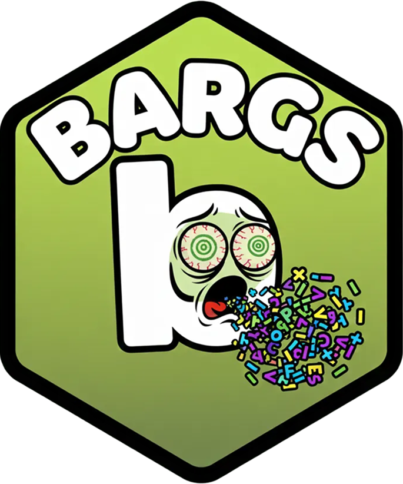

<p align="center">
  <a href="/"></a>
  <h1 align="center"><span class="bargs">⁓ bargs ⁓<span></h1>
  <p align="center">
    <em>"Ex argumentis, veritas"</em>
    <br/>
    <small>by <a href="https://github.com/boneskull" title="@boneskull on GitHub">@boneskull</a></small>
  </p>
</p>

## Install

```shell
npm install @boneskull/bargs
```

## Why bargs?

Most argument parsers make you choose: either a simple API with weak types, or a complex and overengineered DSL. **bargs** provides a combinator-style API for building type-safe CLIs—composable schema definitions with full type inference.

> Also: this is the only argument parser I know of that comes with frickin' _themes_. _Themes_, dogg.

## Quick Start

A CLI with an optional command and a couple options:

```typescript
import { bargs, opt, pos } from '@boneskull/bargs';

await bargs('greet', { version: '1.0.0' })
  .globals(
    opt.options({
      name: opt.string({ default: 'world' }),
      loud: opt.boolean({ aliases: ['l'] }),
    }),
  )
  .command(
    'say',
    pos.positionals(pos.string({ name: 'message', required: true })),
    ({ positionals, values }) => {
      const [message] = positionals;
      const greeting = `${message}, ${values.name}!`;
      console.log(values.loud ? greeting.toUpperCase() : greeting);
    },
    'Say a greeting',
  )
  .defaultCommand('say')
  .parseAsync();
```

```shell
$ greet Hello --name Alice --loud
HELLO, ALICE!
```

## Usage

### Type-Safe by Construction

Each helper returns a fully-typed definition:

```typescript
import { opt, pos } from '@boneskull/bargs';

const verbose = opt.boolean({ aliases: ['v'] });
// Type: BooleanOption & { aliases: ['v'] }

const level = opt.enum(['low', 'medium', 'high'], { default: 'medium' });
// Type: EnumOption<'low' | 'medium' | 'high'> & { default: 'medium' }

const file = pos.string({ name: 'file', required: true });
// Type: StringPositional & { name: 'file', required: true }
```

When you build a CLI with these, the result types flow through automatically—options with defaults or `required: true` are non-nullable.

### Composable

Options and positionals can be merged using callable parsers:

```typescript
import { opt, pos } from '@boneskull/bargs';

// Create separate parsers
const options = opt.options({
  verbose: opt.boolean({ aliases: ['v'] }),
  output: opt.string({ aliases: ['o'], default: 'stdout' }),
});

const positionals = pos.positionals(
  pos.string({ name: 'input', required: true }),
);

// Merge them: positionals(options) combines both
const parser = positionals(options);
// Type: Parser<{ verbose: boolean | undefined, output: string }, [string]>
```

### Simple CLI

For a CLI without subcommands, use `.globals()` with merged options and positionals, then handle the result yourself:

```typescript
import { bargs, opt, pos } from '@boneskull/bargs';

// Merge options and positionals into one parser
// when a positional is variadic, it becomes an array within the result
const parser = pos.positionals(pos.variadic('string', { name: 'text' }))(
  opt.options({
    uppercase: opt.boolean({ aliases: ['u'], default: false }),
  }),
);

const { values, positionals } = await bargs('echo', {
  description: 'Echo text to stdout',
  version: '1.0.0',
})
  .globals(parser)
  .parseAsync();

const [words] = positionals;
const text = words.join(' ');
console.log(values.uppercase ? text.toUpperCase() : text);
```

### Command-Based CLI

For a CLI with multiple subcommands:

```typescript
import { bargs, merge, opt, pos } from '@boneskull/bargs';

await bargs('tasks', {
  description: 'A task manager',
  version: '1.0.0',
})
  .globals(
    opt.options({
      verbose: opt.boolean({ aliases: ['v'], default: false }),
    }),
  )
  .command(
    'add',
    // Use merge() to combine positionals with command-specific options
    merge(
      opt.options({
        priority: opt.enum(['low', 'medium', 'high'], { default: 'medium' }),
      }),
      pos.positionals(pos.string({ name: 'text', required: true })),
    ),
    ({ positionals, values }) => {
      const [text] = positionals;
      console.log(`Adding ${values.priority} priority task: ${text}`);
      if (values.verbose) console.log('Verbose mode enabled');
    },
    'Add a task',
  )
  .command(
    'list',
    opt.options({
      all: opt.boolean({ default: false }),
    }),
    ({ values }) => {
      console.log(values.all ? 'All tasks' : 'Pending tasks');
    },
    'List tasks',
  )
  .defaultCommand('list')
  .parseAsync();
```

```shell
$ tasks add "Buy groceries" --priority high --verbose
Adding high priority task: Buy groceries
Verbose mode enabled

$ tasks list --all
All tasks
```

### Nested Commands (Subcommands)

Commands can be nested to arbitrary depth. _The only limit is your contempt for your users._ Use the **factory pattern**:

```typescript
import { bargs, opt, pos } from '@boneskull/bargs';

await bargs('git')
  .globals(opt.options({ verbose: opt.boolean({ aliases: ['v'] }) }))
  // Factory pattern: receives a builder with parent globals already typed
  .command(
    'remote',
    (remote) =>
      remote
        .command(
          'add',
          pos.positionals(
            pos.string({ name: 'name', required: true }),
            pos.string({ name: 'url', required: true }),
          ),
          ({ positionals, values }) => {
            const [name, url] = positionals;
            // values.verbose is fully typed! (from parent globals)
            if (values.verbose) console.log(`Adding ${name}: ${url}`);
          },
          'Add a remote',
        )
        .command('remove' /* ... */)
        .defaultCommand('add'),
    'Manage remotes',
  )
  .command('commit', commitParser, commitHandler) // Regular command
  .parseAsync();
```

```shell
$ git --verbose remote add origin https://github.com/...
Adding origin: https://github.com/...

$ git remote remove origin
```

The factory function receives a `CliBuilder` that already has parent globals typed, so all nested command handlers get full type inference for merged `global + command` options. See [`examples/nested-commands.ts`](./examples/nested-commands.ts) for a full example.

## API

### bargs(name, options?)

Create a CLI builder.

| Option        | Type                | Description                                 |
| ------------- | ------------------- | ------------------------------------------- |
| `description` | `string`            | Description shown in help                   |
| `version`     | `string`            | Enables `--version` flag                    |
| `epilog`      | `string` or `false` | Footer text in help (see [Epilog](#epilog)) |
| `theme`       | `Theme`             | Help color theme (see [Theming](#theming))  |

### .globals(parser)

Set global options and transforms that apply to all commands.

```typescript
bargs('my-cli').globals(opt.options({ verbose: opt.boolean() }));
// ...
```

### .command(name, parser, handler, description?)

Register a command. The handler receives merged global + command types.

```typescript
.command(
  'build',
  opt.options({ watch: opt.boolean() }),
  ({ values }) => {
    // values has both global options AND { watch: boolean }
    console.log(values.verbose, values.watch);
  },
  'Build the project',
)
```

### .command(name, factory, description?)

Register a nested command group using a factory function. The factory receives a builder that already has parent globals typed, giving full type inference in nested handlers.

```typescript
bargs('main')
  .globals(opt.options({ verbose: opt.boolean() }))
  .command(
    'nested',
    (nested) =>
      nested
        .command('foo', fooParser, ({ values }) => {
          // values.verbose is typed correctly!
        })
        .command('bar', barParser, barHandler),
    'Nested commands',
  )
  .parseAsync();
```

### .defaultCommand(name)

> Or `.defaultCommand(parser, handler)`

Set the command that runs when no command is specified.

```typescript
// Reference an existing command by name
.defaultCommand('list')

// Or define an inline default
.defaultCommand(
  pos.positionals(pos.string({ name: 'file' })),
  ({ positionals }) => console.log(positionals[0]),
)
```

### .parse(args?) / .parseAsync(args?)

Parse arguments and execute handlers.

- **`.parse()`** - Synchronous. Throws if any transform or handler returns a Promise.
- **`.parseAsync()`** - Asynchronous. Supports async transforms and handlers.

```typescript
// Async (supports async transforms/handlers)
const result = await bargs('my-cli').globals(...).parseAsync();
console.log(result.values, result.positionals, result.command);

// Sync (no async transforms/handlers)
const result = bargs('my-cli').globals(...).parse();
```

## Option Helpers

```typescript
import { opt } from '@boneskull/bargs';

opt.string({ default: 'value' }); // --name value
opt.number({ default: 42 }); // --count 42
opt.boolean({ aliases: ['v'] }); // --verbose, -v
opt.boolean({ aliases: ['v', 'verb'] }); // --verbose, --verb, -v
opt.enum(['a', 'b', 'c']); // --level a
opt.array('string'); // --file x --file y
opt.array(['low', 'medium', 'high']); // --priority low --priority high
opt.count(); // -vvv → 3
```

### Option Properties

| Property      | Type       | Description                                                        |
| ------------- | ---------- | ------------------------------------------------------------------ |
| `aliases`     | `string[]` | Short (`['v']` for `-v`) or long aliases (`['verb']` for `--verb`) |
| `default`     | varies     | Default value (makes the option non-nullable)                      |
| `description` | `string`   | Help text description                                              |
| `group`       | `string`   | Groups options under a custom section header                       |
| `hidden`      | `boolean`  | Hide from `--help` output                                          |
| `required`    | `boolean`  | Mark as required (makes the option non-nullable)                   |

### Aliases

Options can have both short (single-character) and long (multi-character) aliases:

```typescript
opt.options({
  verbose: opt.boolean({ aliases: ['v', 'verb'] }),
  output: opt.string({ aliases: ['o', 'out'] }),
});
```

All of these are equivalent:

```shell
$ my-cli -v                # verbose: true
$ my-cli --verb            # verbose: true
$ my-cli --verbose         # verbose: true
$ my-cli -o file.txt       # output: "file.txt"
$ my-cli --out file.txt    # output: "file.txt"
$ my-cli --output file.txt # output: "file.txt"
```

For non-array options, using both an alias and the canonical name throws an error:

```shell
$ my-cli --verb --verbose
Error: Conflicting options: --verb and --verbose cannot both be specified
```

For array options, values from all aliases are merged. Single-character aliases and the canonical name are processed first (in command-line order), then multi-character aliases are appended:

```typescript
opt.options({
  files: opt.array('string', { aliases: ['f', 'file'] }),
});
```

```shell
$ my-cli --file a.txt -f b.txt --files c.txt
# files: ["b.txt", "c.txt", "a.txt"]
# (-f and --files first, then --file appended)
```

### Boolean Negation (--no-<flag>)

All boolean options automatically support a negated form `--no-<flag>` to explicitly set the option to `false`:

```shell
$ my-cli --verbose      # verbose: true
$ my-cli --no-verbose   # verbose: false
$ my-cli                # verbose: undefined (or default)
```

If both `--flag` and `--no-flag` are specified, bargs throws an error:

```shell
$ my-cli --verbose --no-verbose
Error: Conflicting options: --verbose and --no-verbose cannot both be specified
```

In help output, booleans with `default: true` display as `--no-<flag>` (since that's how users would turn them off):

```typescript
opt.options({
  colors: opt.boolean({ default: true, description: 'Use colors' }),
});
// Help output shows: --no-colors  Use colors  [boolean] default: true
```

### opt.options(schema)

Create a parser from an options schema:

```typescript
const parser = opt.options({
  verbose: opt.boolean({ aliases: ['v'] }),
  output: opt.string({ default: 'out.txt' }),
});
// Type: Parser<{ verbose: boolean | undefined, output: string }, []>
```

## Positional Helpers

```typescript
import { pos } from '@boneskull/bargs';

pos.string({ required: true }); // <file>
pos.number({ default: 8080 }); // [port]
pos.enum(['dev', 'prod']); // [env]
pos.variadic('string'); // [files...]
```

### Positional Properties

| Property      | Type      | Description                                            |
| ------------- | --------- | ------------------------------------------------------ |
| `default`     | varies    | Default value                                          |
| `description` | `string`  | Help text description                                  |
| `name`        | `string`  | Display name in help (defaults to `arg0`, `arg1`, ...) |
| `required`    | `boolean` | Mark as required (shown as `<name>` vs `[name]`)       |

### pos.positionals(...defs)

Create a parser from positional definitions:

```typescript
const parser = pos.positionals(
  pos.string({ name: 'source', required: true }),
  pos.string({ name: 'dest', required: true }),
);
// Type: Parser<{}, [string, string]>
```

Use `variadic` for rest arguments (must be last):

```typescript
const parser = pos.positionals(pos.variadic('string', { name: 'files' }));
// Type: Parser<{}, [string[]]>
```

## Merging Parsers

Use `merge()` to combine multiple parsers into one:

```typescript
import { merge, opt, pos } from '@boneskull/bargs';

const combined = merge(
  opt.options({
    priority: opt.enum(['low', 'medium', 'high'], { default: 'medium' }),
  }),
  pos.positionals(pos.string({ name: 'task', required: true })),
);
// Type: Parser<{ priority: 'low' | 'medium' | 'high' }, [string]>
```

You can merge as many parsers as needed—options are merged (later overrides earlier), and positionals are concatenated.

Alternatively, parsers can be merged by calling one with the other:

```typescript
const options = opt.options({ priority: opt.enum(['low', 'medium', 'high']) });
const positionals = pos.positionals(
  pos.string({ name: 'task', required: true }),
);

// These are equivalent:
const combined1 = positionals(options);
const combined2 = options(positionals);
```

Use whichever style you find more readable.

## Transforms

Use `map()` to transform parsed values before they reach your handler:

```typescript
import { bargs, map, opt } from '@boneskull/bargs';

const globals = map(
  opt.options({
    config: opt.string(),
    verbose: opt.boolean({ default: false }),
  }),
  ({ values, positionals }) => ({
    positionals,
    values: {
      ...values,
      // Add computed properties
      timestamp: new Date().toISOString(),
      configLoaded: !!values.config,
    },
  }),
);

await bargs('my-cli')
  .globals(globals)
  .command(
    'info',
    opt.options({}),
    ({ values }) => {
      // values.timestamp and values.configLoaded are available
      console.log(values.timestamp);
    },
    'Show info',
  )
  .parseAsync();
```

Transforms are fully type-safe—the return type becomes the type available in handlers.

### Async Transforms

Transforms can be async:

```typescript
const globals = map(
  opt.options({ url: opt.string({ required: true }) }),
  async ({ values, positionals }) => {
    const response = await fetch(values.url);
    return {
      positionals,
      values: {
        ...values,
        data: await response.json(),
      },
    };
  },
);
```

### CamelCase Option Keys

If you prefer camelCase property names instead of kebab-case, use the `camelCaseValues` transform:

```typescript
import { bargs, map, opt, camelCaseValues } from '@boneskull/bargs';

const { values } = await bargs('my-cli')
  .globals(
    map(
      opt.options({
        'output-dir': opt.string({ default: '/tmp' }),
        'dry-run': opt.boolean(),
      }),
      camelCaseValues,
    ),
  )
  .parseAsync(['--output-dir', './dist', '--dry-run']);

console.log(values.outputDir); // './dist'
console.log(values.dryRun); // true
```

The `camelCaseValues` transform:

- Converts all kebab-case keys to camelCase (`output-dir` → `outputDir`)
- Preserves keys that are already camelCase or have no hyphens
- Is fully type-safe—TypeScript knows the transformed key names

## Epilog

By default, **bargs** displays your package's homepage and repository URLs (from `package.json`) at the end of help output. URLs become clickable hyperlinks in supported terminals.

```typescript
// Custom epilog
bargs('my-cli', {
  epilog: 'For more info, visit https://example.com',
});

// Disable epilog entirely
bargs('my-cli', { epilog: false });
```

## Theming

Customize help output colors with built-in themes or your own:

```typescript
// Use a built-in theme: 'default', 'mono', 'ocean', 'warm'
bargs('my-cli', { theme: 'ocean' });

// Disable colors entirely
bargs('my-cli', { theme: 'mono' });
```

The `ansi` export provides common ANSI escape codes for styled terminal output:

```typescript
import { ansi } from '@boneskull/bargs';

bargs('my-cli', {
  theme: {
    colors: {
      command: ansi.bold,
      flag: ansi.brightCyan,
      positional: ansi.magenta,
      // ...
    },
  },
});
```

Available theme color slots:

| Slot            | What it styles                                  |
| --------------- | ----------------------------------------------- |
| `command`       | Command names (e.g., `init`, `build`)           |
| `defaultText`   | The `default:` label                            |
| `defaultValue`  | Default value (e.g., `false`, `"hello"`)        |
| `description`   | Description text for options and commands       |
| `epilog`        | Footer text (homepage, repository)              |
| `example`       | Example code/commands                           |
| `flag`          | Flag names (e.g., `--verbose`, `-v`)            |
| `positional`    | Positional argument names (e.g., `<file>`)      |
| `scriptName`    | CLI name shown in header                        |
| `sectionHeader` | Section headers (e.g., `USAGE`, `OPTIONS`)      |
| `type`          | Type annotations (e.g., `[string]`, `[number]`) |
| `url`           | URLs (for clickable hyperlinks)                 |
| `usage`         | The usage line text                             |

> [!TIP]
> You don't need to specify all color slots. Missing colors fall back to the default theme.

## Advanced Usage

### Error Handling

**bargs** exports some `Error` subclasses:

```typescript
import {
  bargs,
  BargsError,
  HelpError,
  ValidationError,
} from '@boneskull/bargs';

try {
  await bargs('my-cli').parseAsync();
} catch (error) {
  if (error instanceof ValidationError) {
    // Config validation failed (e.g., invalid schema)
    // i.e., "you screwed up"
    console.error(`Config error at "${error.path}": ${error.message}`);
  } else if (error instanceof HelpError) {
    // Likely invalid options, command or positionals;
    // re-throw to trigger help display
    throw error;
  } else if (error instanceof BargsError) {
    // General bargs error
    console.error(error.message);
  }
}
```

### Programmatic Help

Generate help text programmatically:

```typescript
import { generateHelp, generateCommandHelp } from '@boneskull/bargs';

// These require the internal config structure—see source for details
const helpText = generateHelp(config);
const commandHelp = generateCommandHelp(config, 'migrate');
```

### Hyperlink Utilities

Create clickable terminal hyperlinks ([OSC 8](https://github.com/Alhadis/OSC8-Adoption)):

```typescript
import { link, linkifyUrls, supportsHyperlinks } from '@boneskull/bargs';

// Check if terminal supports hyperlinks
if (supportsHyperlinks()) {
  // Create a hyperlink
  console.log(link('Click me', 'https://example.com'));

  // Auto-linkify URLs in text
  console.log(linkifyUrls('Visit https://example.com for more info'));
}
```

> [!TIP]
> **bargs** already automatically links URLs in `--help` output if the terminal supports hyperlinks.

### Additional Theme Utilities

```typescript
import {
  ansi, // ANSI escape codes
  createStyler, // Create a styler from a theme
  defaultTheme, // The default theme object
  stripAnsi, // Remove ANSI codes from string
  themes, // All built-in themes
} from '@boneskull/bargs';

// Create a custom styler
const styler = createStyler({ colors: { flag: ansi.green } });
console.log(styler.flag('--verbose'));

// Strip ANSI codes for plain text output
const plain = stripAnsi('\x1b[32m--verbose\x1b[0m'); // '--verbose'
```

### Low-Level Utilities

The `handle(parser, fn)` function is exported for advanced use cases where you need to create a `Command` object outside the fluent builder. It's mostly superseded by `.command(name, parser, handler)`.

## Dependencies

**bargs** has zero (0) dependencies. Only Node.js v20+.

## Motivation

I've always reached for [yargs](https://github.com/yargs/yargs) in my CLI projects. However, I find myself repeatedly doing the same things; I have a sort of boilerplate in my head, ready to go (`requiresArg: true` and `nargs: 1`, amirite?). I don't want boilerplate in my head. I wanted to distill my chosen subset of yargs' behavior into a composable API. And so **bargs** was begat.

## License

Copyright © 2025 [Christopher "boneskull" Hiller](https://github.com/boneskull). Licensed under the [Blue Oak Model License 1.0.0](./LICENSE).
